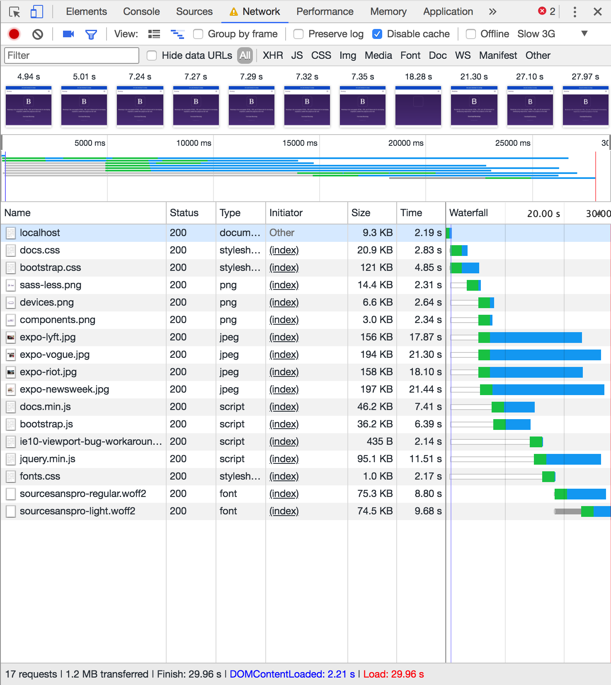

# Bootstrap Documentation Site Performance

## Improvements

### 1. Loading Scripts and fonts.css async
By loading all the scripts asynchronous they load at the same time and don't have to wait on one another. This increases the loading speed by 1 second, but it shows the content 2 seconds earlier, which is more important.

By also loading the fonts.css file asynchronous, the content is shown even sooner. It now shows the content 5 seconds earlier than in the original way.

You can find the changes in the **async-loading** branch.

**BEFORE**

**AFTER**\

### 2. Minify CSS and JS
In order to reduce more loading time I minified the CSS and JS files. I used  to minify the CSS files and I used  to minify the JS files.

By doing this I was able to reduce the loading time by 2 seconds and make the content appear 1 second earlier.

You can find the changes in the **minify** branch.

**BEFORE**

**AFTER**\

