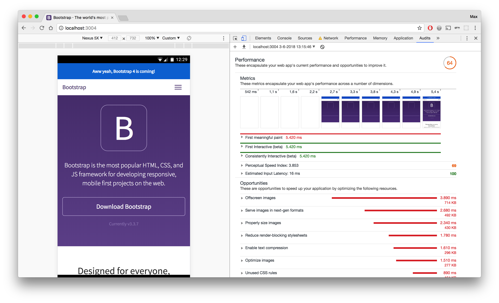
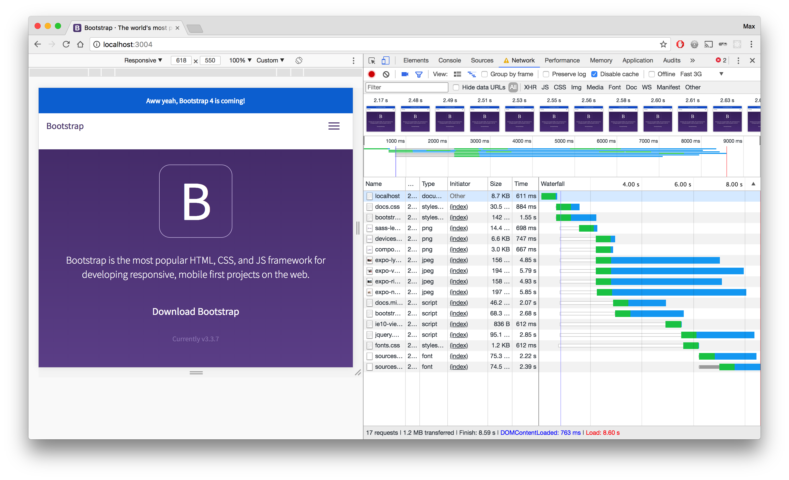
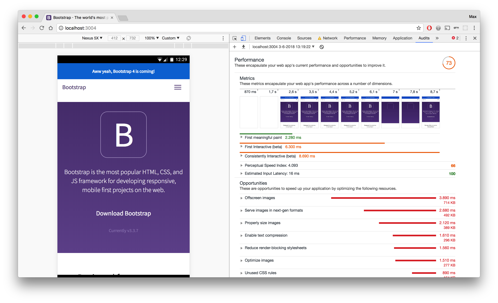
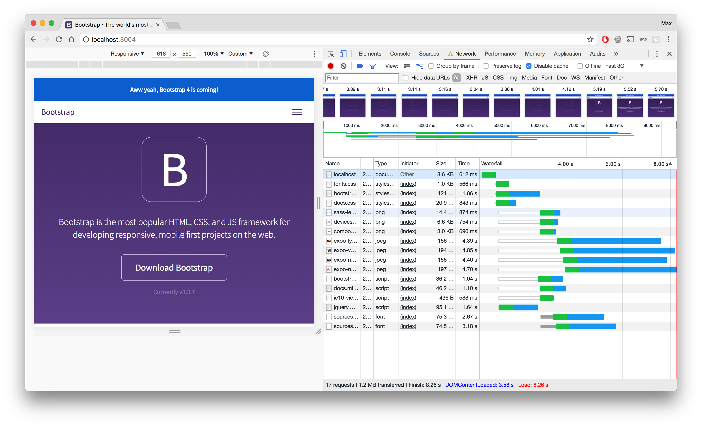
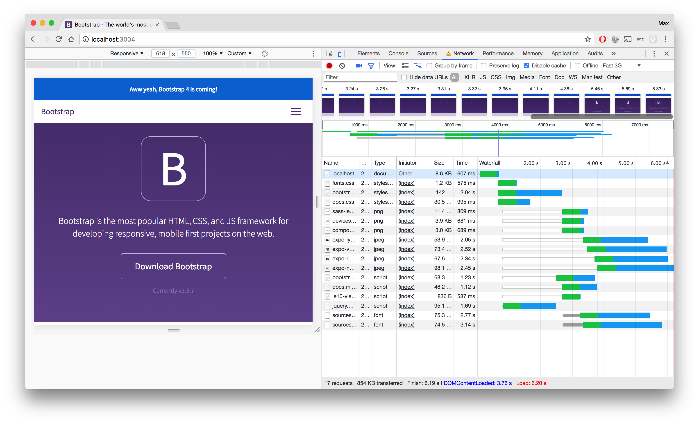
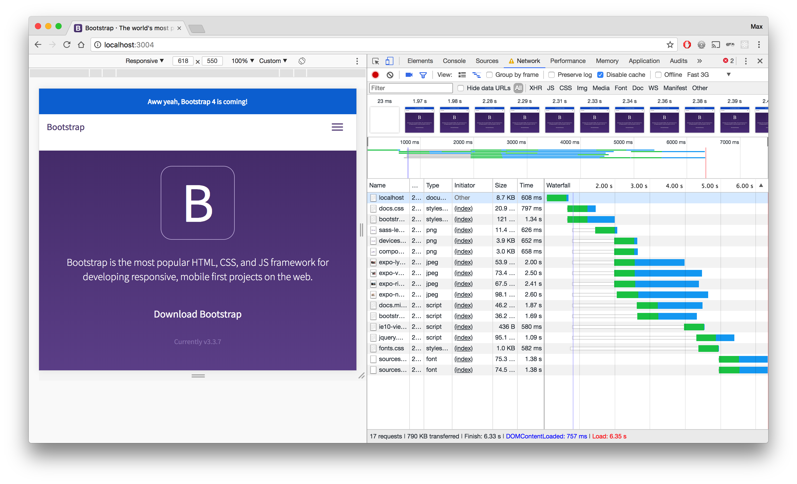
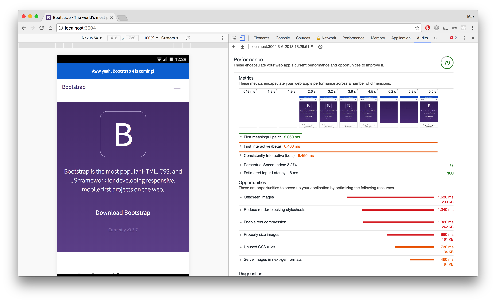

# Bootstrap Documentation Site Performance

I have done performance improvements for the Bootstrap Documentation website to make the website respond faster and perform better.

## Setup

All the audits where done on a Fast 3G internet connection, which was good enough to check the performance on. These were the original stats:

| First meaningful paint | First interactive  | Score  |
| ---------------------- | ------------------ | ------ |
| 5.420 seconds          | 5.420 seconds      | 64/100 |

### Settings
---

* **Browser used:** Google Chrome
* **Google Chrome Dev tools settings:**
  * Disable cache
  * Throttle: 3G Fast
* **Google Chrome Dev tools used:**
  * Network tab
  * Audits

**Original waterfall:**

**Original audit:**

## Improvements

### 1. Loading Scripts and fonts.css async
---

By loading all the scripts asynchronous they load at the same time and don't have to wait on one another. This increases the loading speed by about 1 second, but it shows the content 2 seconds earlier, which is more important.

By also loading the fonts.css file asynchronous, the content is shown even sooner. It now shows the content 3 seconds earlier than in the original way.

You can find the changes in the [async-loading](../async-loading/AUDIT.md) branch. These are the new stats:

| First meaningful paint | First interactive  | Score  |
| ---------------------- | ------------------ | ------ |
| 2.280 seconds          | 6.300 seconds      | 73/100 |
| **-3.140 seconds**     | **+0.880 seconds** | **+9** |

**Waterfall after async loading:**

**Audit after async loading:**

### 2. Minify CSS and JS
---

In order to reduce more loading time I minified the CSS and JS files. I used [CSS Compressor](https://csscompressor.com/) to minify the CSS files and I used [JS Compress](https://jscompress.com/) to minify the JS files.

By doing this I was able to reduce the loading time by half a second and make the content appear half a second earlier as well.

You can find the changes in the [minify](../minify/AUDIT.md) branch. These are the new stats:

| First meaningful paint | First interactive  | Score  |
| ---------------------- | ------------------ | ------ |
| 4.940 seconds          | 4.940 seconds      | 69/100 |
| **-0.480 seconds**     | **-0.480 seconds** | **+5** |

**Waterfall after minify:**

**Audit after minify:**

### 3. Compressing image files
---

By compressing the image files I was able to make some small changes in loading speed. The overall speed got reduced by 0.010 seconds. To compress the image files I used [TinyPNG](https://tinypng.com/).

You can find the changes in the [compress-images](../compress-images/AUDIT.md) branch. These are the new stats:

| First meaningful paint | First interactive  | Score  |
| ---------------------- | ------------------ | ------ |
| 5.410 seconds          | 5.410 seconds      | 64/100 |
| **-0.010 seconds**     | **-0.010 seconds** | **0**  |

**Waterfall after compressing images:**

**Audit after compressing images:**

## Conclusion

After merging all the improvements listed above with the master branch, I tested the website once again to see the final results. These are the final stats:

| First meaningful paint | First interactive  | Score  |
| ---------------------- | ------------------ | ------ |
| 2.060 seconds          | 6.460 seconds      | 79/100 |
| **-3.360 seconds**     | **+1.040 seconds** | **+15**|

**Waterfall after all changes:**

**Audit after all changes:**

So, by taking a few basic steps towards improving the performance, you can come a long way. These are just a few improvements you can make. These improvements already reduce about 3 seconds of loading time, making the website load and respond a lot faster than before the changes.
