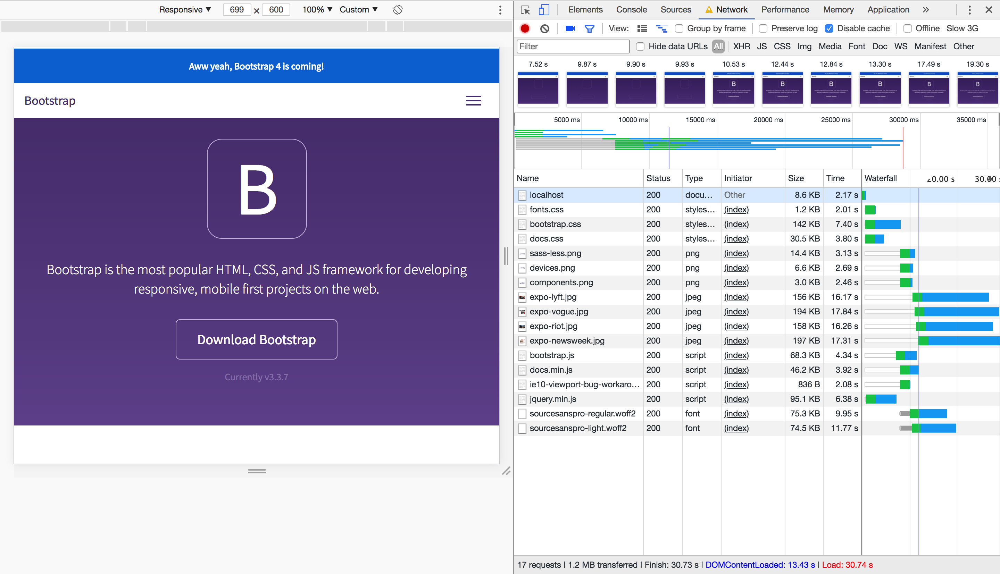
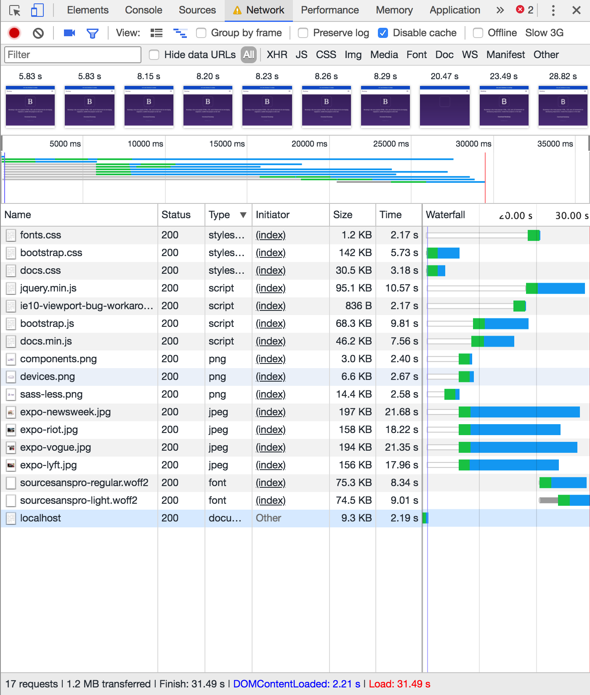

# Bootstrap Documentation Site Performance

## Improvements

### 1. Loading Scripts and fonts.css async
By loading all the scripts asynchronous they load at the same time and don't have to wait on one another. This increases the loading speed by 1 second, but it shows the content 2 seconds earlier, which is more important.

By also loading the fonts.css file asynchronous, the content is shown even sooner. It now shows the content 5 seconds earlier than in the original way.

**BEFORE**

**AFTER**

